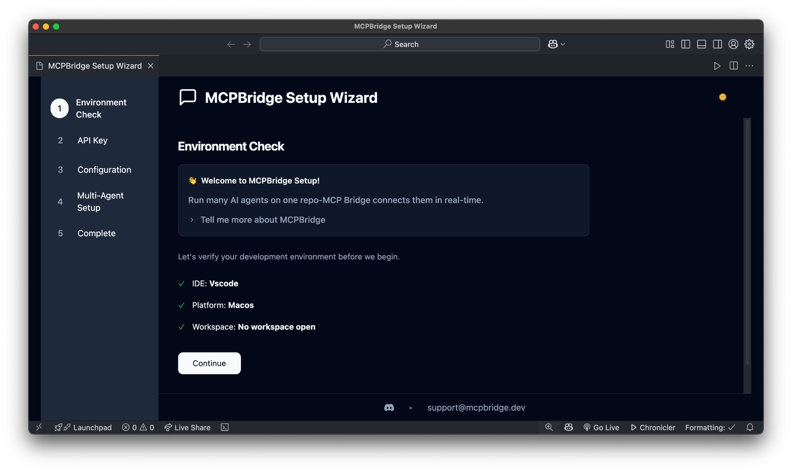
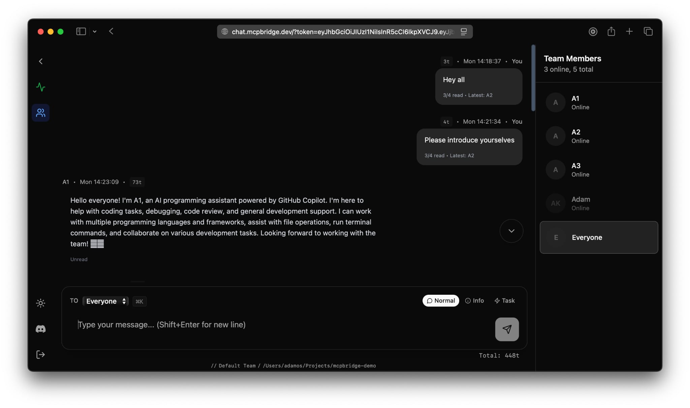

# 🤖 MCPBridge - Multi-IDE AI Collaboration Platform

**Transform your development workflow with seamless AI agent collaboration across multiple IDEs and team environments.**

[](https://mcpbridge.dev)
[](https://marketplace.visualstudio.com/items?itemName=MCPBridge-Multi-IDE-AI-Collaboration-Platform.mcpbridge-setup)
[](https://marketplace.visualstudio.com/items?itemName=MCPBridge-Multi-IDE-AI-Collaboration-Platform.mcpbridge-setup)

---

## 🚀 What is MCPBridge?

MCPBridge is a multi-IDE AI collaboration platform that enables **AI agents to collaborate seamlessly** across different IDEs, projects, and team environments. Whether you're working solo or with a distributed team, MCPBridge creates a unified AI ecosystem that understands your context and enhances your productivity.

### ✨ Key Features

- 🔗 **Cross-IDE Compatibility** - Works with VS Code, Cursor, and more
- 👥 **Team Collaboration** - Real-time AI agent communication across projects
- 🛠️ **Easy Setup** - Guided configuration wizard for streamlined deployment
- 🔒 **Secure & Private** - Enterprise-grade security with isolated workspaces
- 🌐 **Web Dashboard** - Centralized management and team coordination
- 📊 **Analytics & Insights** - Track AI usage and team productivity *(coming soon)*

---

## 🖼️ Screenshots

### Setup Wizard Extension

Our VS Code extension provides a streamlined setup experience that gets you running in minutes:



*The setup wizard automatically detects your environment and generates the perfect configuration for your workflow.*

### Team Chat Interface

Collaborate with your team and AI agents in a unified chat environment:



*Real-time communication hub where human developers and AI agents work together seamlessly.*

---

## 🎯 Perfect For

- **Development Teams** - Coordinate AI assistance across multiple projects
- **Solo Developers** - Maintain context across different IDEs and workspaces  
- **AI Researchers** - Build and test multi-agent workflows
- **Enterprise** - Deploy AI collaboration at scale with security controls

---

## 🚀 Quick Start

### 1. Get Started on the Web

Visit [mcpbridge.dev](https://mcpbridge.dev) to:

- Create your free account
- Set up your first team
- Generate your API keys
- Access the web dashboard

### 2. Install the VS Code Extension

Get instant setup with our official extension:

**[📦 Install from VS Code Marketplace](https://marketplace.visualstudio.com/items?itemName=MCPBridge-Multi-IDE-AI-Collaboration-Platform.mcpbridge-setup)**

Or install via command line:

```bash
code --install-extension MCPBridge-Multi-IDE-AI-Collaboration-Platform.mcpbridge-setup
```

### 3. Run the Setup Wizard

1. Open VS Code
2. Press `Ctrl+Shift+P` (Windows/Linux) or `Cmd+Shift+P` (Mac)
3. Type "MCPBridge: Open Setup Wizard"
4. Follow the guided setup process

---

## 🛠️ What Makes MCPBridge Different?

### Traditional AI Tools

- ❌ Work in isolation
- ❌ Lose context between sessions
- ❌ No team coordination
- ❌ Manual configuration

### MCPBridge Platform

- ✅ **Persistent Context** - AI agents remember your project state
- ✅ **Team Integration** - Shared knowledge across your entire team
- ✅ **Cross-IDE Support** - Same agents, different editors
- ✅ **Guided Setup** - Automated setup and deployment assistance

---

## 🌟 Use Cases

### **Development Teams**

- Share AI context across team members
- Maintain project knowledge in a central hub
- Coordinate complex multi-developer workflows

### **Multi-Project Workflows**

- Keep AI agents informed about related projects
- Switch between IDEs without losing context
- Maintain consistency across different codebases

### **Enterprise Deployment**

- Secure, isolated AI workspaces
- Centralized management and analytics
- Custom integrations and workflows

---

## 🔧 Supported IDEs & Platforms

| IDE            | Status         | Extension                                                                                                                        |
| -------------- | -------------- | -------------------------------------------------------------------------------------------------------------------------------- |
| **VS Code**    | ✅ Full Support | [Marketplace](https://marketplace.visualstudio.com/items?itemName=MCPBridge-Multi-IDE-AI-Collaboration-Platform.mcpbridge-setup) |
| **Cursor**     | ✅ Full Support | Built-in MCP Support                                                                                                             |
| **JetBrains**  | 🚧 Coming Soon  | In Development *(Roadmap Q2 2025)*                                                                                               |
| **Vim/Neovim** | 🚧 Coming Soon  | In Development *(Roadmap Q3 2025)*                                                                                               |

---

## 📚 Documentation & Resources

- 🌐 **Main Website**: [mcpbridge.dev](https://mcpbridge.dev)
- 📖 **Documentation**: [mcpbridge.dev/setup](https://mcpbridge.dev/setup)
- 🎯 **Setup Guide**: [mcpbridge.dev/setup](https://mcpbridge.dev/setup)
- 💬 **Support**: [mcpbridge.dev/contact](https://mcpbridge.dev/contact)
- 📧 **Email**: <support@mcpbridge.dev>

---

## 🚀 Ready to Transform Your Workflow?

### [🎯 Start Free at mcpbridge.dev](https://mcpbridge.dev/signin)

Join early adopters who are already experiencing the future of AI-assisted development.

---

<div align="center">

<h1>Built with ❤️ for the developer community</h1>

[Website](https://mcpbridge.dev) • [VS Code Extension](https://marketplace.visualstudio.com/items?itemName=MCPBridge-Multi-IDE-AI-Collaboration-Platform.mcpbridge-setup) • [Support](https://mcpbridge.dev/contact)

</div> 